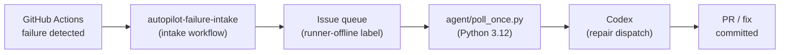

# ci-autopilot

CI autopilot worker/runtime - detects GitHub Actions failures and inventories queued repair issues via a Python agent

[](https://github.com/Coding-Autopilot-System/ci-autopilot/actions/workflows/ci.yml)
[](https://www.python.org/)
[](LICENSE)

## Overview

`ci-autopilot` packages the worker/runtime side of the platform. It monitors GitHub Actions workflows, detects failures, and exposes them through an issue queue. The current Python worker is deliberately read-only: it inventories queued issues on a self-hosted runner. Autonomous repair dispatch and queue state transitions are not implemented yet.

The agent (`agent/poll_once.py`) is a Python 3.12 stdlib-only program that polls the issue queue and lists queued repair tasks for operator visibility. No external dependencies are required.

## Repo boundary

- `autopilot-core` is the control plane for org-level scheduling, rollout, and PR governance.
- `ci-autopilot` is the worker/runtime implementation for runner execution, queue polling, and repair dispatch.
- `autopilot-demo` is the demonstration target used to show the runtime and control plane working together.

## Architecture



**Core components:**

- **autopilot-failure-intake.yml** - Intake workflow triggered on `workflow_run` failure events; creates a queued issue
- **autopilot-create-issue.yml** - Creates GitHub issues via `actions/github-script` when monitored workflows fail
- **fixer.yml** - Runs the read-only `agent/poll_once.py` queue inventory on the self-hosted Windows runner
- **agent/poll_once.py** - Python 3.12 stdlib agent; validates repository input and inventories the issue queue
- **runner-smoke-test.yml** - Smoke tests the self-hosted runner on demand
- **runner-health.yml** - Manual runner health check (dispatch only)

## Enterprise proof points

- Deliberately small runtime surface: Python 3.12 stdlib-only agent for easier audit and rebuild.
- Clear separation of concerns: issue intake and governance stay in the control plane; worker execution and future guarded repair dispatch stay on the worker boundary.
- Self-hosted runner model supports enterprise network boundaries, managed toolchains, and least-privilege token handling.
- Queue-driven intake creates an auditable handoff between CI failure detection and operator review.

## Quick Start

```pwsh
# Prerequisites: Python 3.12 and authenticated GitHub CLI
$env:GH_TOKEN = gh auth token
python -m agent.poll_once
```

The worker only reads and lists queued issues. It does not execute issue content, mutate repositories, or dispatch Codex.

For full runner registration, service setup, and local development instructions see the [Setup Guide](https://github.com/Coding-Autopilot-System/ci-autopilot/wiki/Setup-Guide) wiki page.

## Runbook path

1. Read [docs/control-plane.md](docs/control-plane.md) for the issue-queue contract with `autopilot-core`.
2. Use [docs/runner-setup.md](docs/runner-setup.md) to provision the worker host.
3. Use [docs/operations.md](docs/operations.md) and [docs/troubleshooting.md](docs/troubleshooting.md) for day-2 support.

## Documentation

| Source | Description |
|--------|-------------|
| [docs/architecture.md](docs/architecture.md) | System architecture and design goals |
| [docs/runner-setup.md](docs/runner-setup.md) | Runner registration and service setup |
| [docs/operations.md](docs/operations.md) | Day-2 operations runbook |
| [docs/security.md](docs/security.md) | Security posture and access model |
| [docs/control-plane.md](docs/control-plane.md) | Failure intake and issue control plane |
| [docs/troubleshooting.md](docs/troubleshooting.md) | Lightweight troubleshooting guide |
| [GitHub Pages](https://coding-autopilot-system.github.io/ci-autopilot/) | Professional docs landing page |

**Wiki:** [Home](https://github.com/Coding-Autopilot-System/ci-autopilot/wiki/Home) | [Setup Guide](https://github.com/Coding-Autopilot-System/ci-autopilot/wiki/Setup-Guide) | [Architecture](https://github.com/Coding-Autopilot-System/ci-autopilot/wiki/Architecture) | [Configuration Reference](https://github.com/Coding-Autopilot-System/ci-autopilot/wiki/Configuration-Reference)

## Ecosystem

Part of the [Coding-Autopilot-System](https://github.com/Coding-Autopilot-System) ecosystem alongside the adjacent autopilot repos: [autopilot-core](https://github.com/Coding-Autopilot-System/autopilot-core) | [autopilot-demo](https://github.com/Coding-Autopilot-System/autopilot-demo)
