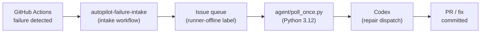

# ci-autopilot

AI-powered CI autopilot — detects GitHub Actions failures and autonomously dispatches repairs via a Python agent

[](https://github.com/Coding-Autopilot-System/ci-autopilot/actions/workflows/ci.yml)
[](https://www.python.org/)
[](LICENSE)

## Overview

ci-autopilot is an AI-powered CI repair agent that monitors GitHub Actions workflows, detects failures, triages them via an issue queue, and dispatches autonomous repairs using a Python agent backed by Codex. It runs on a self-hosted runner and coordinates the full lifecycle from failure detection to merged fix.

The agent (`agent/poll_once.py`) is a Python 3.12 stdlib-only program that polls the issue queue, picks up queued repair tasks, and dispatches them to the Codex repair pipeline. No external dependencies are required.

## Architecture



**Core components:**

- **autopilot-failure-intake.yml** — Intake workflow triggered on `workflow_run` failure events; creates a queued issue
- **autopilot-create-issue.yml** — Creates GitHub issues via `actions/github-script` when monitored workflows fail
- **fixer.yml** — Main CI autopilot; runs `agent/poll_once.py` on the self-hosted Windows runner
- **agent/poll_once.py** — Python 3.12 stdlib agent; polls the issue queue and dispatches repairs
- **runner-smoke-test.yml** — Smoke tests the self-hosted runner on demand
- **runner-health.yml** — Manual runner health check (dispatch only)

## Quick Start

```bash
# Prerequisites: Python 3.12, GitHub CLI, GH_TOKEN env var
export GH_TOKEN=<your_token>
python -m agent.poll_once
```

For full runner registration, service setup, and local development instructions see the [Setup Guide](https://github.com/Coding-Autopilot-System/ci-autopilot/wiki/Setup-Guide) wiki page.

## Documentation

| Source | Description |
|--------|-------------|
| [docs/architecture.md](docs/architecture.md) | System architecture and design goals |
| [docs/runner-setup.md](docs/runner-setup.md) | Runner registration and service setup |
| [docs/operations.md](docs/operations.md) | Day-2 operations runbook |
| [docs/security.md](docs/security.md) | Security posture and access model |
| [docs/control-plane.md](docs/control-plane.md) | Failure intake and issue control plane |
| [GitHub Pages](https://coding-autopilot-system.github.io/ci-autopilot/) | Professional docs landing page |

**Wiki:** [Home](https://github.com/Coding-Autopilot-System/ci-autopilot/wiki/Home) | [Setup Guide](https://github.com/Coding-Autopilot-System/ci-autopilot/wiki/Setup-Guide) | [Architecture](https://github.com/Coding-Autopilot-System/ci-autopilot/wiki/Architecture) | [Configuration Reference](https://github.com/Coding-Autopilot-System/ci-autopilot/wiki/Configuration-Reference)

## Ecosystem

Part of the [Coding-Autopilot-System](https://github.com/Coding-Autopilot-System) ecosystem: [gsd-orchestrator](https://github.com/Coding-Autopilot-System/gsd-orchestrator) | [Promptimprover](https://github.com/Coding-Autopilot-System/Promptimprover) | [autogen](https://github.com/Coding-Autopilot-System/autogen)
