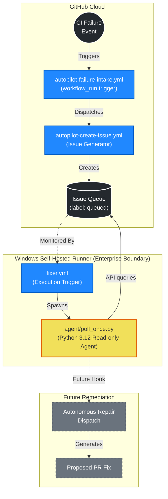

# Architecture

CI Autopilot is a runner-hosted automation layer that coordinates failure intake, queued-issue inventory, and operator visibility. It is designed with safety, observability, and deterministic execution as top priorities.

## System Architecture

The following diagram illustrates the lifecycle of a failure detection and the role of the Python worker.

## Core Components

1. **GitHub Actions Intake Layer (`.github/workflows`)**
   - **`autopilot-failure-intake.yml`**: Triggers on `workflow_run` failure events across the repository.
   - **`autopilot-create-issue.yml`**: A reusable utility that interacts with the GitHub API to generate a standardized issue representing the failure, labeled correctly for the queue.

2. **The Worker / Runner Layer**
   - **`fixer.yml`**: A workflow assigned exclusively to the self-hosted runner. It manages the execution environment and triggers the agent.
   - **`agent/poll_once.py`**: A deliberately lightweight Python 3.12 standard-library-only script. It queries the GitHub API to list issues labeled as "queued" and presents them for operator visibility. It currently performs no write operations.

3. **Infrastructure (Self-Hosted Runner)**
   - Operates within an enterprise-controlled environment (Windows service).
   - Allows strict egress controls and localized credential management, isolating the worker from the GitHub public cloud.

## Design Goals

- **Safe Automation:** The agent is currently read-only, establishing an auditable handoff between CI failure detection and operator review before implementing future automated remediation.
- **Minimal Surface Area:** Utilizing only the Python standard library for the agent simplifies auditing and reduces supply chain risks.
- **Enterprise Network Boundaries:** The self-hosted runner model allows for managed toolchains and least-privilege network policies.
- **Clear Separation of Concerns:** Issue intake and governance remain in the control plane, while worker execution stays on the designated host.

## Data Flow

1. **Failure Occurs:** A monitored CI workflow fails.
2. **Intake & Queuing:** `autopilot-failure-intake.yml` runs, extracting context and calling `autopilot-create-issue.yml` to create a tracking issue tagged with `queued`.
3. **Execution:** On a schedule or manual dispatch, `fixer.yml` runs on the self-hosted Windows runner.
4. **Polling:** The runner executes `agent/poll_once.py`, which authenticates via `GH_TOKEN` or `GITHUB_TOKEN`, queries the open queued issues, and lists them out to `STDOUT`.
5. **Observability:** Job logs capture the output, providing the operator with a clean inventory of failures needing attention.
