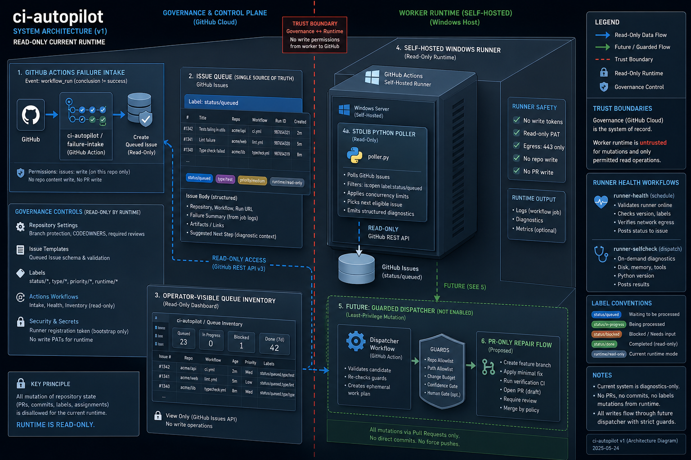
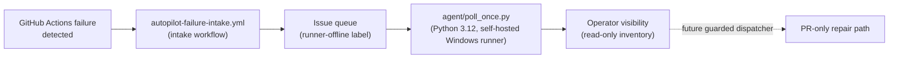

# Architecture

`ci-autopilot` packages the worker/runtime side of the platform. The runtime surface is
deliberately small: `agent/poll_once.py` is a Python 3.12 stdlib-only program (no external
dependencies) that runs on a self-hosted Windows runner via the `fixer.yml` workflow, polling
the issue queue and listing queued repair tasks for operator visibility.

<!-- codex:generate-image prompt="A lighthouse keeper's watch room with a self-hosted Windows terminal scanning a harbor of docked ships each labeled with a GitHub issue number, the keeper logs a read-only inventory ledger, a dashed line to a locked gate labeled future guarded dispatcher; isometric, enterprise blue/graphite palette" style="isometric, enterprise, clean" replaces="mermaid-above" -->

## Core components

- **autopilot-failure-intake.yml** — intake workflow triggered on `workflow_run` failure
  events; creates a queued issue.
- **autopilot-create-issue.yml** — creates GitHub issues via `actions/github-script` when
  monitored workflows fail.
- **fixer.yml** — runs the read-only `agent/poll_once.py` queue inventory on the self-hosted
  Windows runner.
- **agent/poll_once.py** — Python 3.12 stdlib agent; validates repository input and inventories
  the issue queue.
- **runner-smoke-test.yml** / **runner-health.yml** — smoke-test and scheduled health check for
  the self-hosted runner.

## Trust boundaries

- Clear separation of concerns: issue intake and governance stay in `autopilot-core`; worker
  execution and any future guarded repair dispatch stay on this repo's worker boundary.
- The agent is intentionally read-only today — it does not execute issue content, mutate
  repositories, or dispatch Codex. Guarded autonomous repair dispatch is tracked as an open
  finding (see [Decisions](Decisions.md)), not shipped functionality.
- The self-hosted runner model supports enterprise network boundaries and least-privilege token
  handling; this repo provisions no cloud infrastructure.

<!-- docs-verified: 4590462b38e0a835385c3a7c4a4b35d761bed5dc 2026-07-08 -->
